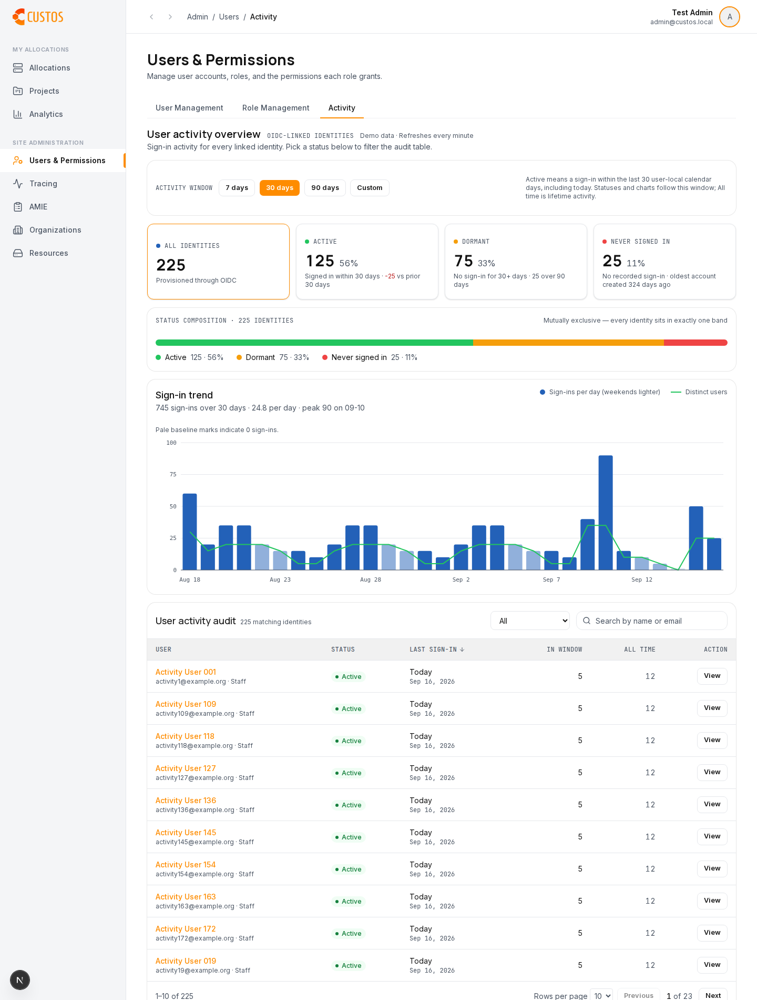

# User Activity frontend contract

This is the current frontend baseline for User Activity. Apache [PR #573](https://github.com/apache/airavata-custos/pull/573) is a historical snapshot of the first frontend-only draft. Keep that PR closed; later work stays on the `aimee-RH` fork until frontend and backend are both ready, then one complete PR can go upstream.

The backend, migrations, and OpenAPI generation are **not** in this change. Production data still requires the follow-up backend. Local preview uses MSW (`NEXT_PUBLIC_PORTAL_USE_MSW=true`).

## Access and population

All activity reads require `core:users:activity:read`. The UI hides the Activity tab and makes no activity requests without it. The backend must independently enforce the privilege for lists, aggregates, and individual reads. Population: OIDC-linked identities. Custos has no invitation timestamp; never-signed-in copy uses account creation, never “invite age”.

## One window, three disjoint groups

The dashboard defaults to 30 days, with 7/30/90 presets and a custom integer from 1 to 365. The selected window includes today and the previous N−1 user-local calendar dates.

- `active`: has logged in and `inactive_days < N`
- `dormant`: has logged in and `inactive_days >= N`
- `never`: no recorded login
- `all`: union of those three groups

Never is excluded from Dormant. Do not substitute the old `/users/inactive` behavior (which included Never). User-local calendar boundaries, including DST and time-zone fallback, must be consistent between list filtering, row `inactive_days`, and aggregate counts.

Summary cards and charts describe the full authorized population. Search and status filters affect only the audit table. Lifetime values are labelled All time / Lifetime. Displayed timestamps are UTC; relative day labels use the backend's `inactive_days`.

## List

`GET /users/activity?window=30&status=all&query=&limit=10&offset=0&sort=last_login&direction=desc`

Required query parameters: `window` (1–365) and `status` (`all|active|dormant|never`), applied before pagination. Each row includes `window_login_count`. Sort keys: `name`, `last_login`, `login_count`, with stable user-ID tie-breaking. Never-login dates stay last in either direction.

```json
{
  "items": [{
    "user_id": "u-1",
    "name": "Alice",
    "email": "alice@example.org",
    "role_names": ["Staff"],
    "last_login": "2026-09-16T12:00:00Z",
    "inactive_days": 0,
    "login_count": 52,
    "window_login_count": 12,
    "login_day_count": 31,
    "current_streak": 2
  }],
  "total": 1,
  "limit": 10,
  "offset": 0,
  "window_days": 30,
  "status": "all"
}
```

For never-login users `last_login` and `inactive_days` are null and counts are zero. Echo normalized `window_days`, `status`, `limit`, and `offset`. The frontend rejects older unfiltered responses rather than showing misleading data. Empty items may be `[]` or `null`. Total is the filtered count, not the current page length.

`role_names` is optional. The UI renders names after the email. Missing or `null` omits the suffix; `[]` means no assigned roles. MSW Staff / Student / Researcher values are preview fixtures only.

## Analytics

- `GET /users/activity/analytics?window=N`
- `GET /users/{id}/activity/analytics?window=N`

Required: `generated_at`, `window_days`, `total_users`, `users_ever_logged_in`, `active_users`, `lifetime_login_count`, `lifetime_active_days`, `window_login_count`, `window_active_days`, and `trend` (`date`, `active_users`, `login_count`). `active_users <= users_ever_logged_in <= total_users`.

Optional supplemental fields, all nullable:

- `prior_active_users`: distinct OIDC users with a daily fact in the immediately preceding equal-length local-calendar window
- `dormant_over_90_days`: dormant users in the selected window whose inactivity is strictly greater than 90 local days
- `oldest_never_created_at`: earliest account creation among OIDC users with zero recorded logins

These are aggregate server statistics. Missing or `null` fields hide supplemental copy; they must not become invented zeros. The UI shows “vs prior N days” and “oldest account created N days ago” using UTC calendar-day difference from `generated_at`. The “over 90 days” subcount is hidden when the selected window is already longer than 90 days.

Cards derive Active from `active_users`, Dormant from `users_ever_logged_in - active_users`, and Never from `total_users - users_ever_logged_in`. Trend dates are user-local date buckets. The frontend fills missing calendar dates with zeros, using the UTC date of `generated_at` for the nominal range, and preserves returned boundary dates.

The drawer starts on the dashboard window, then allows an independent 1–365-day range. Invalid windows return 400, unauthorized reads 403, absent users 404.

## Review access

Dormant and never-signed-in rows use the **Review access** action; active rows use **View**. Both open the same engagement drawer. The Review access panel states that it shows sign-in activity only and does not change roles or cluster access.

## New-session capture

The server-side NextAuth initial account callback calls `POST /me/login-events` with the OIDC bearer and `{}`. It does not submit user identity, event ID, or timestamps from browser input. Capture uses at most three attempts, 2-second timeouts, and 50/100ms backoff. Permanent 4xx responses stop retrying. Capture failure logs a generic message and leaves the session intact.

## Preview and tests

Run `pnpm exec msw init public --save` once after installing dependencies, then set `NEXT_PUBLIC_PORTAL_USE_MSW=true`. Activity mocks model 225 users and parameter-aware queries. The local preview is labelled Demo data. List and analytics queries refresh every 60 seconds while the page is visible.

From `web/`: `pnpm lint`, `pnpm typecheck`, `pnpm test`, `pnpm gen:api:check`, `pnpm build`, and `pnpm exec playwright test tests/admin-user-activity.e2e.ts --workers=1`.

Mock checks do not prove live backend or OIDC capture. Do not mark this ready for Apache until the backend implements this contract and live integration passes.


